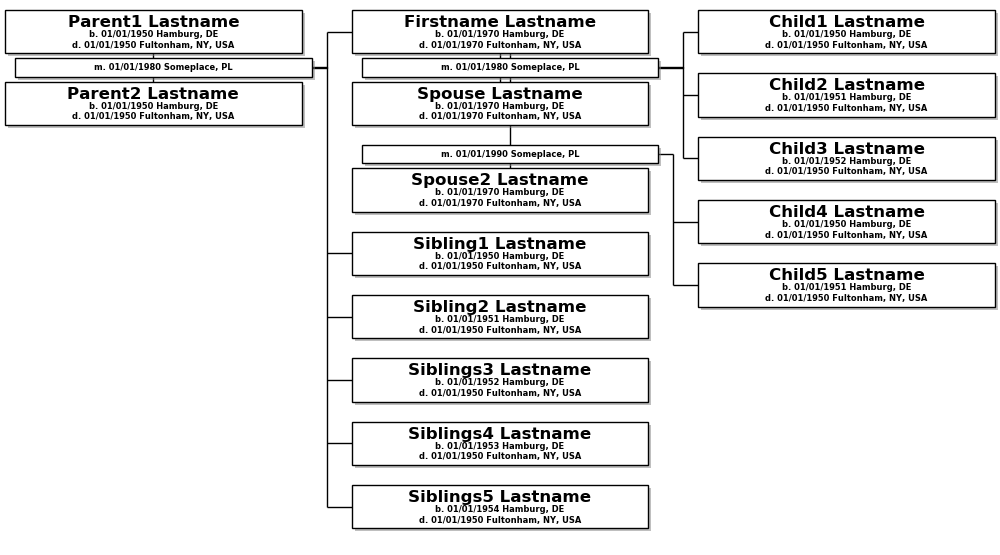

# Person Graphs
I wanted summary graphs for a write-up and none of the graph options in Gramps quite fitted me. 
My aim is to show parents, siblings, spouse and children while taking up as little vertical space
as possible. 

Not yet working and probably re-inventing the wheel.

Example:
